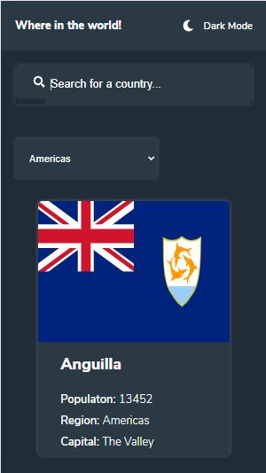
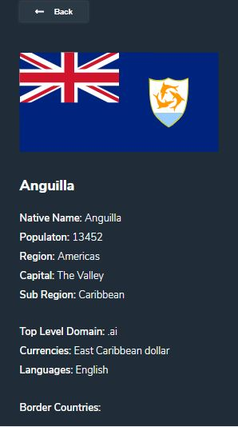
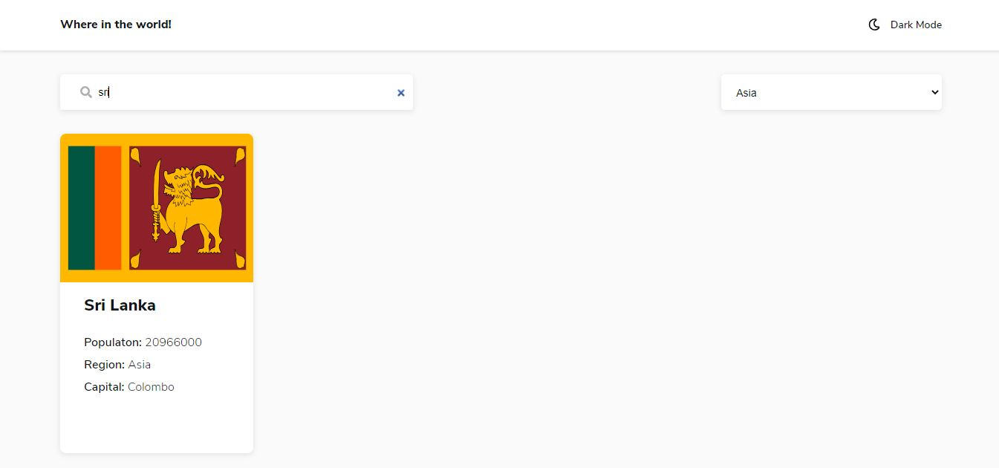
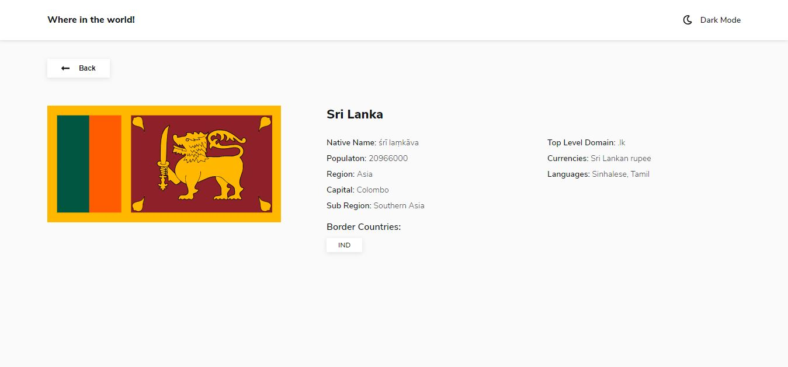

# Frontend Mentor - REST Countries API with color theme switcher solution

This is a solution to the [REST Countries API with color theme switcher challenge on Frontend Mentor](https://www.frontendmentor.io/challenges/rest-countries-api-with-color-theme-switcher-5cacc469fec04111f7b848ca). Frontend Mentor challenges help you improve your coding skills by building realistic projects.

## Table of contents

-   [Overview](#overview)
    -   [The challenge](#the-challenge)
    -   [Screenshot](#screenshot)
    -   [Links](#links)
-   [My process](#my-process)
    -   [Built with](#built-with)
    -   [What I learned](#what-i-learned)
    -   [Useful resources](#useful-resources)
-   [Author](#author)

## Overview

    REST Countries API with color theme switcher. To implement a solution where one can know about a country they want.

### The challenge

Users should be able to:

-   See all countries from the API on the homepage
-   Search for a country using an `input` field
-   Filter countries by region
-   Click on a country to see more detailed information on a separate page
-   Click through to the border countries on the detail page
-   Toggle the color scheme between light and dark mode _(optional)_

### Screenshot






### Links

-   Solution URL: [Add solution URL here](https://github.com/gowthamss/react-countries)
-   Live Site URL: [Add live site URL here](https://gowthamss.github.io/react-countries/)

## My process

    Looking at this challenge and thinking about how easily I can implement it, I decided to implement it React. As I am building the app there was a time to use state in multiple places. Then I thought instead of passing the state down to all the components where it is needed, I thought it is good to use redux and implemented it in the app, and that makes the state management easy and saved time.

    And I also used ***reselect*** to use memoized state. For CSS, I used SASS which made me write less styles.

    As the challenge mentioned that the selected country details has to be shown in a separate page, I thought it is best to use ***react-router*** and integrated it in the app.

    At last, breaking up the entire app into multiple small components and re-using them is a very good thing I liked the most.

### Built with

-   Semantic HTML5 markup
-   CSS custom properties
-   Flexbox
-   CSS Grid
-   Mobile-first workflow
-   [React](https://reactjs.org/) - JS library
-   [Redux](https://redux.js.org/) - For state management
-   [SASS](https://sass-lang.com/) - For styles
-   [FontAwesome](https://fontawesome.com/) - For icons
-   [ReactRouter](https://reactrouter.com/) - For routing

### What I learned

In this challenge especially, I mainly learned how to use react-router, redux and reselect and use them effectively. And I will continue using them.

To see how you can add code snippets, see below:

```js
export const selectCountriesOnSearchAndFilter = createSelector(
    [selectSearchText, selectFilterOption, selectCountries],
    (text, option, countries) =>
        countries.filter(
            (country) =>
                country.name.toLowerCase().includes(text.toLowerCase()) &&
                country.region.toLowerCase() === option.toLowerCase()
        )
);
```

### Useful resources

-   [Example resource 1](https://www.digitalocean.com/community/tutorials/how-to-use-font-awesome-5-with-react) - This helped me how to correctly use font awesome icons inside React.

## Author

-   Website - [Add your name here](https://www.your-site.com)
-   Frontend Mentor - [@gowthamss](https://www.frontendmentor.io/profile/gowthamss)
-   Twitter - [@Gowthamss15](https://www.twitter.com/Gowthamss15)
